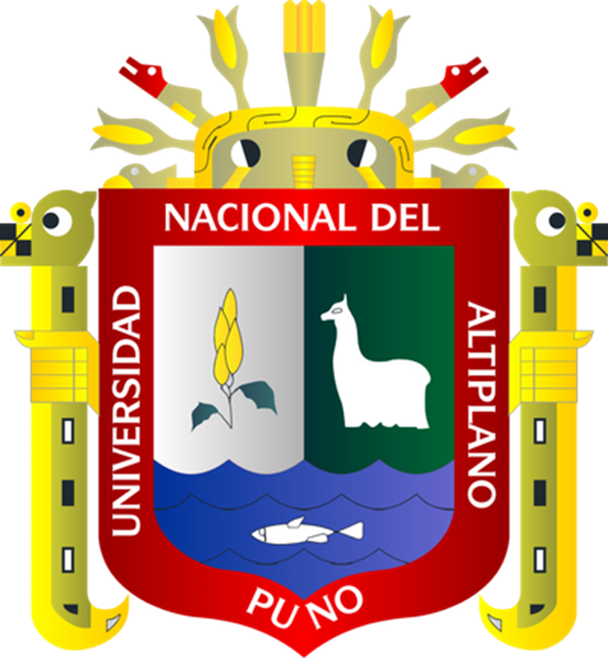

<div align="center">
  <table width="100%">
    <tr>
      <td width="20%" align="left">
        
      </td>
      <td width="60%" align="center">
        <h1 style="color:#0077b6;">UNIVERSIDAD NACIONAL DEL ALTIPLANO</h1>
        <h3 style="color:#023e8a;">Facultad de Ingeniería Estadística e Informática</h3>
         <h3 style="color:#023e8a;">Códigos que estructuran</h3>
        <p>
      </td>
      <td width="20%" align="right">
        
      </td>
    </tr>
  </table>
    <p><strong>Alumno:</strong> Ruth Karina Apaza Solis </p> 
    <strong>Curso:</strong> Estructura de Datos</p>
    <strong>Docente:</strong> Fred Torres Cruz</p>
</div>

# Índice

- [Índice](#índice)
- [Introducción](#introducción)
- [¿Qué es programación?](#qué-es-programación)
  - [¿Qué es un lenguaje de programación?](#qué-es-un-lenguaje-de-programación)
  - [¿Qué es la estructura de datos?](#qué-es-la-estructura-de-datos)
  - [¿Para qué sirven las estructuras de datos?](#para-qué-sirven-las-estructuras-de-datos)
- [Programación en c++](#programación-en-c)
  - [Mi primer programa](#mi-primer-programa)
- [Operadores](#operadores)

# Introducción

Este libro presenta una síntesis ordenada de los principales contenidos abordados durante el curso de programación en C++ y estructuras de datos. Su objetivo es consolidar los conocimientos adquiridos, facilitar su comprensión y servir como material de consulta para futuros estudios.

Se inicia con una introducción a la programación, el lenguaje C++ y los conceptos básicos sobre estructuras de datos. Luego, se desarrollan temas fundamentales como operadores, estructuras de control, funciones y arrays. Posteriormente, se abordan estructuras dinámicas como pilas, colas y listas enlazadas, así como el uso de punteros y operadores específicos del lenguaje. Finalmente, se incluye el concepto de recursión, una técnica clave en la resolución de problemas computacionales.

Cada capítulo combina teoría y ejemplos prácticos, orientando al lector hacia una comprensión integral y aplicada del lenguaje C++.

# ¿Qué es programación?

La programación informática es el arte del proceso por el cual se limpia, codifica, traza y protege el código fuente de programas computacionales, en otras palabras, es indicarle a la computadora lo que tiene que hacer. 

<div style="float: right; margin: 0 0 10px 15px; width: 500px;">
  
</div>

La programación informática es una de las habilidades esenciales que aprendes cuando estudias informática.
 
Detrás de todos los programas informáticos que conocemos y usamos de manera cotidiana para facilitarnos diversas actividades de nuestro día con día, existe todo un proceso para poderlos crear. Este proceso es conocido como programación, conozcamos un poco más sobre lo que conlleva este proceso.

Por medio de la programación se establecen los pasos a seguir para la creación del código fuente de los diversos programas informáticos.

Este código le indicara al programa informático que tiene que hacer y como realizarlo.

La programación se guía por una serie de normas y un conjunto de órdenes, instrucciones y expresiones que tienden a ser semejantes a una lengua natural acotada. Por lo cual recibe el nombre de lenguaje de programación. Y así como en los idiomas también en la informática existen diversos lenguajes de programación.

Hablando de forma más técnica, la programación se realiza mediante el uso de algoritmos, que se podrían explicar cómo reglas o instrucciones que deben seguirse para resolver el problema y lograr el objetivo.

Algunas de ellas pueden agruparse y de ese modo recibir un nombre para tener la facilidad de ser invocadas con facilidad tantas veces como sea necesario.
> ### 💻 *“La programación es cómo haces que las computadoras resuelvan problemas.”*


## ¿Qué es un lenguaje de programación?

Un **lenguaje de programación** es un conjunto de reglas y símbolos que permiten a los seres humanos escribir instrucciones que una computadora puede entender y ejecutar. Es el medio de comunicación entre el programador y la máquina.

<div style="float: right; margin: 0 0 10px 15px; width: 500px;">
  
</div>

Así como los humanos usamos distintos idiomas para comunicarnos, las computadoras también entienden distintos lenguajes. Cada lenguaje tiene su propia **sintaxis** (forma de escribir) y **semántica** (significado de las instrucciones).

Los lenguajes de programación se utilizan para:

- Crear aplicaciones y programas.
- Controlar el hardware de una computadora.
- Automatizar tareas repetitivas.
- Manipular datos y resolver problemas lógicos.

Algunos ejemplos comunes de lenguajes de programación son:

- **C** y **C++**
- **Python**
- **Java**
- **JavaScript**
- **Ruby**
- **Go**

## ¿Qué es la estructura de datos?

Una estructura de datos es una forma organizada y eficiente de almacenar, gestionar y acceder a la información dentro de un programa. Su propósito principal es facilitar el procesamiento de grandes cantidades de datos, permitiendo realizar operaciones como inserción, eliminación, búsqueda y ordenamiento de manera óptima.

Las estructuras de datos pueden clasificarse en primitivas (como enteros, caracteres y booleanos) y no primitivas (como arrays, listas, pilas, colas, árboles y grafos). Cada una de ellas responde a diferentes necesidades y se selecciona en función del tipo de problema a resolver.

El estudio de las estructuras de datos es fundamental en la programación, ya que permite diseñar algoritmos más eficientes y comprender cómo se gestiona la memoria y el rendimiento en una aplicación.


## ¿Para qué sirven las estructuras de datos?

Las estructuras de datos cumplen un rol esencial en el desarrollo de programas eficientes y funcionales. Su principal utilidad radica en la organización lógica y estructurada de la información, lo cual permite optimizar el uso de los recursos del sistema y mejorar el rendimiento de los algoritmos.

A través de las estructuras de datos, es posible realizar operaciones complejas como el almacenamiento dinámico, la gestión de grandes volúmenes de información, el acceso rápido a elementos específicos, así como la implementación de técnicas de búsqueda, ordenamiento y recorrido. Además, muchas soluciones informáticas dependen directamente de la correcta elección y manipulación de estas estructuras.
Ya sean las más utilizadas comúnmente -como las variables, arrays, conjuntos o clases- o las diseñadas para un propósito específico -árboles, grafos, tablas, etc.-, una estructura de datos nos permite trabajar en un algo nivel de abstracción almacenando información para luego acceder a ella, modificarla y manipularla.


Las estructuras de datos desempeñan un papel fundamental en el desarrollo de programas eficientes y funcionales. Su principal objetivo es organizar la información de manera lógica y estructurada, lo que permite optimizar el uso de los recursos del sistema, como la memoria y el tiempo de procesamiento, y mejorar significativamente el rendimiento de los algoritmos implementados.

Mediante el uso adecuado de estructuras de datos, es posible llevar a cabo operaciones complejas como el almacenamiento dinámico de información, la gestión y manipulación de grandes volúmenes de datos, el acceso rápido y directo a elementos específicos, así como la implementación de técnicas eficientes de búsqueda, ordenamiento y recorrido. La correcta selección y aplicación de estas estructuras es crucial para garantizar que las soluciones informáticas sean efectivas y escalables.

Las estructuras de datos pueden clasificarse en aquellas más comunes y generales, como las variables, arrays, conjuntos y clases, así como en aquellas diseñadas para necesidades específicas, tales como árboles, grafos, tablas hash, entre otras. Estas últimas permiten modelar relaciones y conexiones complejas entre datos, ampliando las capacidades del programa para resolver problemas avanzados.

En esencia, una estructura de datos proporciona un nivel de abstracción que facilita la organización, almacenamiento, acceso, modificación y manipulación de la información. Esta abstracción no solo simplifica el diseño de algoritmos, sino que también contribuye a mantener la claridad y modularidad del código, aspectos fundamentales en el desarrollo de software profesional.

# Programación en c++
La programación en C++ es el proceso de escribir instrucciones utilizando el lenguaje de programación C++ para que una computadora realice tareas específicas. C++ es un lenguaje de propósito general, compilado y multiparadigma, lo que significa que permite programar de diferentes maneras, incluyendo programación estructurada, orientada a objetos y, en algunos casos, programación funcional.

Fue creado por Bjarne Stroustrup a principios de la década de 1980 como una extensión del lenguaje C, incorporando características adicionales como clases, objetos, herencia y manejo de excepciones.

## Mi primer programa

```cpp
#include <iostream>
using namespace std;

int main() {
    cout << "Hola, mundo!" << endl;
    return 0;
}
```
**Explicación**
 
1. `#include <iostream>`

**¿Qué hace?**  
    Le dice al programa que use una **biblioteca llamada iostream**, que permite mostrar mensajes en la pantalla o recibir datos del teclado.

  ✅ **Ejemplo real**: es como decirle a tu programa: *“Usa las herramientas necesarias para poder imprimir mensajes.”*


1. `using namespace std;`

**¿Qué hace?**  
    Le indica al programa que puede usar funciones como `cout` sin tener que escribir `std::cout`.

  ✅ **Traducción fácil**: le dice a C++ que use un “espacio de nombres” donde están los comandos comunes.


1. `int main() {`

**¿Qué hace?**  
    Aquí empieza el programa.  
  **`main()`** es el punto de inicio: es donde el programa comienza a ejecutarse.

  ✅  **Piensa en esto como el corazón del programa**

1. `cout << "Hola, mundo!" << endl;`

**¿Qué hace?**  
    Imprime el mensaje `"Hola, mundo!"` en la pantalla.

    🧠 `cout`: Significa "console output" (salida por consola).  
    🧠 `<<`: Se usa para enviar texto a la consola.  
    🧠 `endl`: Hace un salto de línea, como presionar ENTER.

- ✅ **Lo que verás en pantalla**:

 
  ```
    Hola, mundo!
  ```


1. `return 0;`

**¿Qué hace?**  
    Le dice al sistema que el programa terminó **correctamente**.

    ✅ `0` significa “todo bien”.


1. `}`

  **¿Qué hace?**  
    Cierra la función `main`.  
    Es el final del programa.


# Operadores
